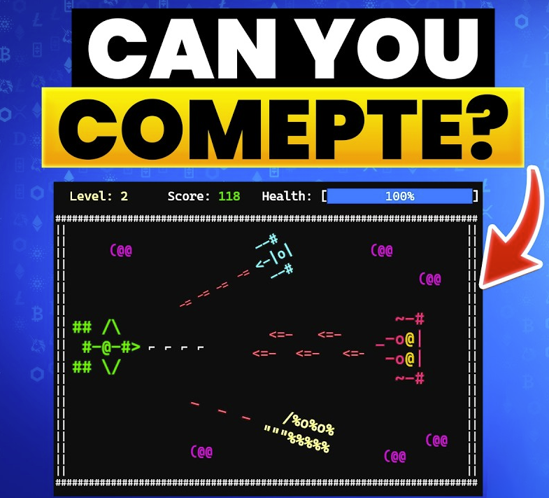

# Space Impact – C++ Game Project

  

Space Impact Game is final-term **C++ Game Project** by **M Ahmad Amin** for the **Programming Fundamentals (PF)** course *(1nd semester, BS Computer Science)* at **[University of Engineering & Technology](https://uet.edu.pk)**.

**Note:**
It is the initial version of the Space Impact game, developed using C++ procedural programming before being later restructured in **C#** and **object-oriented design** in the Object-Oriented Programming (OOP) course *(2nd semester, BS Computer Science)*.

You can explore the OOP C# version of the game here [Space-Impact-OOP](https://github.com/AhmadAmin5/Space-Impact-OOP-Game) on my GitHub Profile [@AhmadAmin5](https://github.com/AhmadAmin5).

## Technologies Used

- **Language:** C++  
- **Platform:** Console Application  
- **Framework:** Procedural Programming
- **IDE used:** VS Code

## Game Concept

The galaxy is under attack, and only you can save the **Milky Way**!  
You must pilot your spaceship through **3 challenging levels**, battling **4 different enemies**, including the **final mastermind boss**.

Survive all levels, defeat the mastermind, and restore peace to the stars.

## Features

- Smooth console-based gameplay  
- Player spaceship with movement and shooting mechanics  
- Multiple enemy types with different behaviors  
- Progressive difficulty across levels  
- Boss fight with unique patterns  
- Clear OOP structure and modular codebase  

## Learning Objective

This console-based space shooter game was inspired by the iconic Space Impact from the Nokia 1100. The primary goal of this project was to apply fundamental programming concepts in C++, such as:

- Variables & DataTypes
- Control Structures (if/else, loops)
- Functions
- Arrays
- File Handling
- Procedural decomposition and modular design
